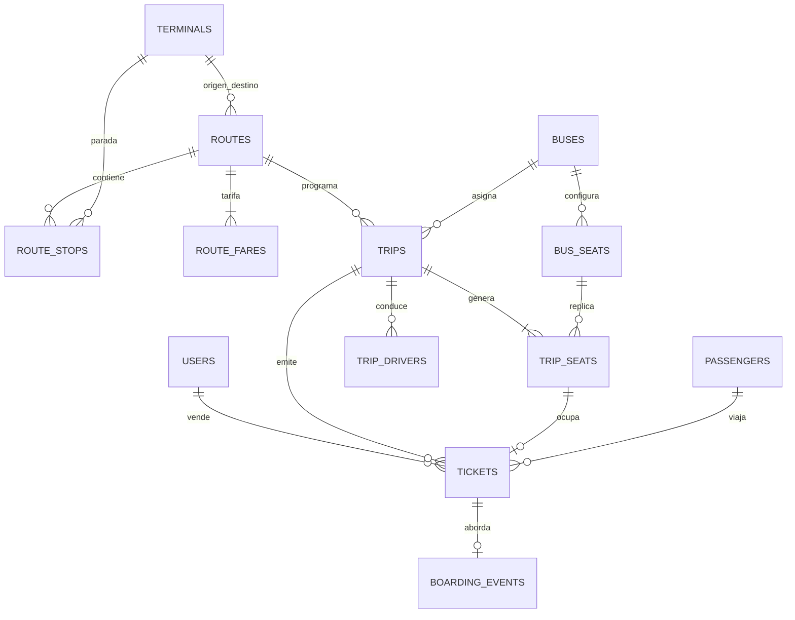

# Diagrama entidad–relación

```mermaid
erDiagram
  USERS ||--o{ TICKETS : vende
  TERMINALS ||--o{ ROUTES : origen_destino
  ROUTES ||--o{ ROUTE_STOPS : contiene
  TERMINALS ||--o{ ROUTE_STOPS : parada
  ROUTES ||--|{ ROUTE_FARES : tarifa
  ROUTES ||--o{ TRIPS : programa
  BUSES ||--o{ BUS_SEATS : configura
  BUSES ||--o{ TRIPS : asigna
  TRIPS ||--|{ TRIP_SEATS : genera
  BUS_SEATS ||--o{ TRIP_SEATS : replica
  TRIPS ||--o{ TRIP_DRIVERS : conduce
  TRIPS ||--o{ TICKETS : emite
  TRIP_SEATS ||--o| TICKETS : ocupa
  PASSENGERS ||--o{ TICKETS : viaja
  TICKETS ||--o| BOARDING_EVENTS : aborda
```
